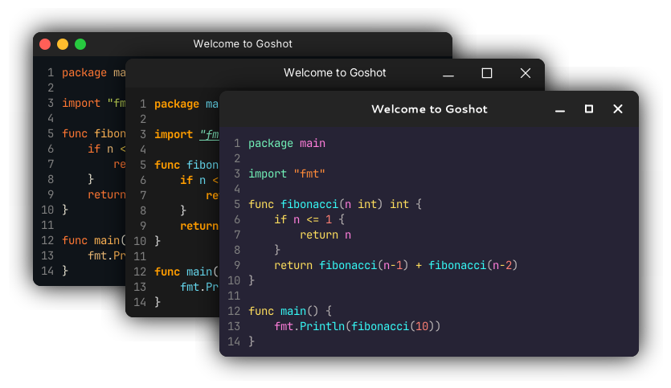

# Goshot

<a href="https://pkg.go.dev/github.com/watzon/goshot"></a>
<a href="https://goreportcard.com/report/github.com/watzon/goshot"></a>
<a href="LICENSE"></a>

Goshot is a powerful Go library and CLI tool for creating beautiful screenshots of code and terminal command output with customizable window chrome, syntax highlighting, and backgrounds. Similar to [Carbon](https://carbon.now.sh) and [Silicon](https://github.com/Aloxaf/Silicon), Goshot allows you to create stunning visual representations of your code snippets for documentation, presentations, or social media sharing.

<div align="center">
    
</div>


## ✨ Features

- 🎨 Beautiful syntax highlighting with multiple themes
- 🖼 Customizable window chrome (macOS, Windows, Linux styles)
- 🌈 Various background options (solid colors, gradients, images)
- 🔤 Custom font support
- 📏 Adjustable padding and margins
- 💾 Multiple export formats (PNG, JPEG)
- 🛠 Both CLI and library interfaces
- 🚀 Command execution support

## Quick Start

### Installation

> [!NOTE]  
> The CLI is a work in progress, but should be more or less functional.

```bash
# Install the CLI tool
go install github.com/watzon/goshot/cmd/goshot@latest

# Install the library
go get github.com/watzon/goshot
```

#### Package Managers

##### Arch Linux (AUR)
```bash
# Using yay
yay -S goshot-bin

# Using paru
paru -S goshot-bin
```

##### Ubuntu/Debian
```bash
# Add the PPA
sudo add-apt-repository ppa:watzon/goshot
sudo apt update

# Install goshot
sudo apt install goshot
```

[](https://repology.org/project/goshot/versions)

### Basic Usage

```go
package main

import (
    "image/color"
    "log"

    "github.com/watzon/goshot/background"
    "github.com/watzon/goshot/chrome"
    "github.com/watzon/goshot/render"
)

func main() {
    // Create a new canvas with macOS chrome and gradient background
    canvas := render.NewCanvas().
        SetChrome(chrome.NewMacChrome(chrome.WithTitle("Hello World"))).
        SetBackground(
            background.NewGradientBackground(
                background.LinearGradient,
                background.GradientStop{Color: color.RGBA{R: 26, G: 27, B: 38, A: 255}, Position: 0},
                background.GradientStop{Color: color.RGBA{R: 40, G: 42, B: 54, A: 255}, Position: 1},
            ).
                SetAngle(45).
                SetPadding(40).
                SetCornerRadius(8).
                SetShadow(
                    background.NewShadow().
                        SetOffset(0, 3).
                        SetBlur(20).
                        SetSpread(8).
                        SetColor(color.RGBA{R: 0, G: 0, B: 0, A: 200}),
                ),
        ).
        SetCodeStyle(&render.CodeStyle{
            Language:        "go",
            Theme:           "dracula",
            TabWidth:        4,
            ShowLineNumbers: true,
        })

    // Render code to file
    code := `func main() {
        fmt.Println("Hello, World!")
    }`
    
    img, err := canvas.RenderToImage(code)
    if err != nil {
        log.Fatal(err)
    }
    
    if err := render.SaveAsPNG(img, "code.png"); err != nil {
        log.Fatal(err)
    }
}
```

## Documentation

For detailed documentation, examples, and guides, please visit our [Wiki](https://github.com/watzon/goshot/wiki):

- [Installation Guide](https://github.com/watzon/goshot/wiki/Installation) - Detailed installation instructions
- [Library Usage](https://github.com/watzon/goshot/wiki/Library-Usage) - Library documentation and examples
- [Configuration](https://github.com/watzon/goshot/wiki/Configuration) - Configuration options and customization
- [Contributing](https://github.com/watzon/goshot/wiki/Contributing) - Guidelines for contributing

## License

This project is licensed under the MIT License - see the [LICENSE](LICENSE) file for details.
